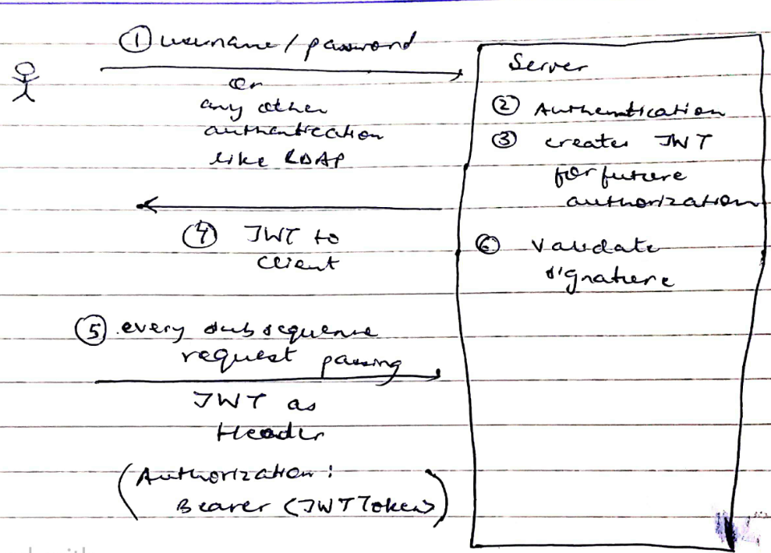
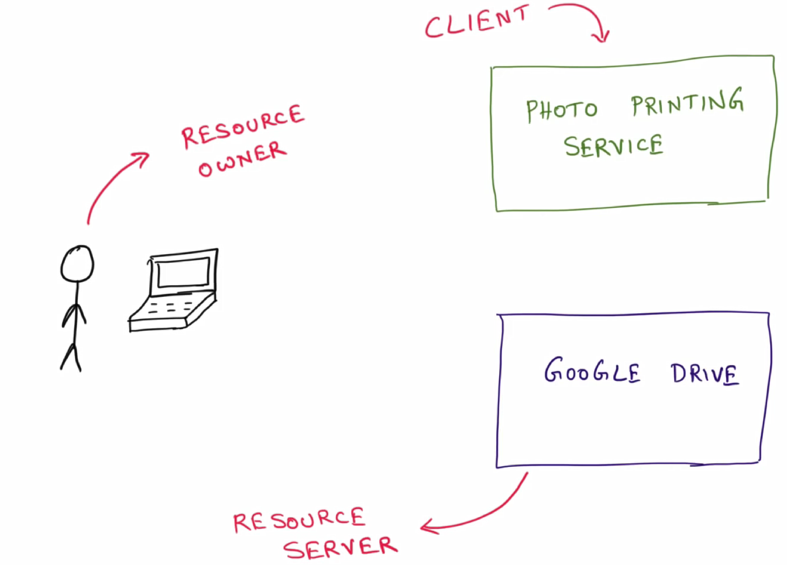

Table of content
- [Web Security](#web-security)
- [Spring security overview](#spring-security-overview)
	- [Core terms used in spring security](#core-terms-used-in-spring-security)
	- [How springboot security works?](#how-springboot-security-works)
	- [Custom username and password?](#custom-username-and-password)
	- [Configure multiple users in spring security](#configure-multiple-users-in-spring-security)
	- [In memory authentication](#in-memory-authentication)
	- [Configure authorization](#configure-authorization)
	- [How to configure http security(API level security) based on user role?](#how-to-configure-http-securityapi-level-security-based-on-user-role)
	- [Example to use inMemory authentication and use authorization](#example-to-use-inmemory-authentication-and-use-authorization)
	- [JDBC authentication](#jdbc-authentication)
	- [JPA authentication](#jpa-authentication)
	- [LDAP authentication](#ldap-authentication)
	- [JWT](#jwt)
		- [Structure of JWT](#structure-of-jwt)
		- [Flow of JWT token usage](#flow-of-jwt-token-usage)
		- [How server validate JWT token?](#how-server-validate-jwt-token)
		- [Some obervations on JWT](#some-obervations-on-jwt)
	- [JWT authorization in spring security](#jwt-authorization-in-spring-security)
	- [OAuth](#oauth)
		- [OAuth terminologies](#oauth-terminologies)
	- [Types of oauth flows](#types-of-oauth-flows)
		- [Authorization code flow](#authorization-code-flow)
	- [Example: login with default username and password](#example-login-with-default-username-and-password)
	- [Example: login with custom username and password](#example-login-with-custom-username-and-password)
	- [Example: configure mulitple users inmemory](#example-configure-mulitple-users-inmemory)
	- [Example: configure authorization (API level security)](#example-configure-authorization-api-level-security)
	- [Example for using JDBC](#example-for-using-jdbc)
	- [Example for using JPA](#example-for-using-jpa)
		- [Configure to connect database using any data source (either jpa or any other)](#configure-to-connect-database-using-any-data-source-either-jpa-or-any-other)
		- [Configure jpa](#configure-jpa)
	- [Example for using LDAP](#example-for-using-ldap)
	- [Example to configure jwt](#example-to-configure-jwt)
- [Spring security](#spring-security)
	- [Form based authentication](#form-based-authentication)
- [Configure default username and generated password](#configure-default-username-and-generated-password)
	- [Create a springboot rest application](#create-a-springboot-rest-application)
	- [Enable sprinboot security](#enable-sprinboot-security)
- [Configure Custom username and password](#configure-custom-username-and-password)
	- [Using WebSecurityConfigurerAdapter](#using-websecurityconfigureradapter)
	- [Using properties defined in application.properties](#using-properties-defined-in-applicationproperties)
- [Configure role based accessed to endpoint](#configure-role-based-accessed-to-endpoint)
	- [Example](#example)
- [Configure Custom username and password via DB](#configure-custom-username-and-password-via-db)
	- [Example](#example-1)
- [Configure password encrypted](#configure-password-encrypted)
	- [password encryption](#password-encryption)
	- [Configure encrypted password via BCrypt](#configure-encrypted-password-via-bcrypt)
- [springboot custom login form](#springboot-custom-login-form)
	- [Explaination](#explaination)
	- [Example](#example-2)
- [How to disable springboot security](#how-to-disable-springboot-security)
- [Configure google auth server with your application](#configure-google-auth-server-with-your-application)
	- [OAuth](#oauth-1)
	- [OAuth2](#oauth2)
	- [Example (configure your application with google)](#example-configure-your-application-with-google)
		- [create application that integrate with google login using oauth2](#create-application-that-integrate-with-google-login-using-oauth2)
		- [Configure application url in google cloud for oauth2](#configure-application-url-in-google-cloud-for-oauth2)
- [Configure springboot application with facebook login using oauth2](#configure-springboot-application-with-facebook-login-using-oauth2)
	- [Configure on facebook side](#configure-on-facebook-side)
	- [configure springboot application](#configure-springboot-application)
	- [Revoke your application's authorization from facebook account](#revoke-your-applications-authorization-from-facebook-account)
- [JWT (pronounced jot)](#jwt-pronounced-jot)
	- [Example to setup JWT token in springboot application](#example-to-setup-jwt-token-in-springboot-application)
- [Oauth2](#oauth2-1)
	- [Roles in OAuth](#roles-in-oauth)
- [Reference](#reference)

# Web Security 
For web security we need
- login screen 
- verify username/password
- maintain session

When we use springboot security, we don't need to do anything. spring will take care of all things

**Steps to configure springboot secuity:**  
- create a springboot rest project 
- expose some end point
- apply springboot security

**Why springboot security:**  
It provide many inbuilt features  
- CSRF attack prevention
- session fixation protection
- allow user to logout
- provide user authentication via username and password
- provide user role configuration
- provide security header integration
  - HSTS

    > **Note**  
    > HTTP Strict Transport Security (HSTS) is a web security policy mechanism that helps to protect websites against cookie hijacking.  
    > session fixation attacks attempt to exploit the vulnerability of a system that allows one person to fixate (find or set) another person's session identifier.

# Spring security overview

## Core terms used in spring security
```
Authentication // who are you? for login the application
Authorization // what you want?
Principal 
	// logged in user.  
	// You can have multiple gmail accounts
	// if you want to login the xyz app using specific google account
Granted authorities
	//operation allow to perform based of authority
Role
	Group of authorities
```		

## How springboot security works?
When you add springboot security dependency
it does following things
- create login page
- apply authentication with default username : user and password: generated one
- handle login errors 
- apply authorization on every urls

**How spring security redirects every request to login page?**  
It uses servlet filter concept internally

## Custom username and password?
```
spring.security.user.name=foo
spring.security.user.password=foo
```

## Configure multiple users in spring security
Using AuthenticationManager

**AuthenticationManager**
- It manages authentication in spring security application
- It calls authenticate() and check whether you are successfully authencate or not
- We use builder pattern to deal with, means we work with AuthenticationManagerBuilder instead of creating AuthenticationManager instance
	
**How do get the AuthenticationManagerBuilder?**  
- we leveraging a hook that is already available
	
**What type of hook we use?**  
There is a class called **WebSecurityConfigurerAdapter**
You need to extends this class and override configure(AuthenticationManagerBuilder) method	


## In memory authentication
```
auth.imMemoryAuthentication()
	.withUser("blah")
	.password("blah")
	.roles("USER")
	.and()
	.withUser("foo")
	.password("foo")
	.roles("ADMIN");
```

**How to a password encoder**  
Just add a bean
```java
@Bean 
public PasswordEncoder getPasswordEncoder(){
	return NoOpPasswordEncoder.getInstance();
}
```
## Configure authorization
Our goal is: Certain APIs to be accessed by role1 and certain APIs to be accessed by some other role role2 

Lets have an application which has already configure
- spring security dependency
- In memory authentication configured


Lets have, 
```
/ 			accessed by all (means no authentication required)
/user 		just login is required (not specific role is needed) it can have ADMIN, USER no matters
/admin		ADMIN role only
```

ex. 
```java	
@RestController
class HomeController{

	@GetMapping("/")
	public String home(){
		return "<h1>Welcome</h1>";
	}
	
	@GetMapping("/user")
	public String user(){
		return "<h1>Welcome user</h1>";
	}
	
	@GetMapping("/admin")
	public String admin(){
		return "<h1>Welcome admin</h1>";
	}
}
```
## How to configure http security(API level security) based on user role?
Using HttpSecurity class
	
**How to get HttpSecurity object?**  
Using **WebSecurityConfigurerAdapter** and override configure(HttpSecurity) method
```java	
http.authorizedRequests()			// it starts the chain
	.antMatchers("/","static/css","static/js").permitAll() // configure url1, it do not required login as we define permit all
	.antMatchers("/**").hasRole("ADMIN") // configure url2
	.antMatchers("/user").hasRole("USER") // configure url3
	.and().formLogin();				// type of authentication
```
Internally what springboot security dependency does
	
If you are not using springboot security dependency,  
Then you need to define filter manually  
Filter which intercept all incoming request  
This filter is "**DelegatingFilterProxy**"  

```	
<filter>
	<filter-name>springSecurityFilterChain</filter-name>
	<filter-class>org.springframework.web.filter.DelegatingFilterProxy</filter-class>
</filter>

<filter>
	<filter-name>springSecurityFilterChain</filter-name>
	<url-pattern>/*</url-pattern>
</filter>
```
- 	
- 
- 
- 

## Example to use inMemory authentication and use authorization
- create springboot project with dependency: web, security

## JDBC authentication
auth.jdbcAuthentication()  
goto [example-for-using-jdbc](#example-for-using-jdbc)

## JPA authentication
```
UserJPARepository.findByUserName(String useName) returns User pojo

UserDetailsService.loadUserByUsername(String userName)
	wrap User pojo in UserDetails 

SecurityConfiuration.conigure(AuthenticationManagerBuilder auth)
	calling userDetailService
```
goto [example-for-using-jpa](#example-for-using-jpa)

## LDAP authentication

LDAP
- Lightweight Directory access protocol
- It is a protocol that maintaining directory information over the network
- It can be used for any kind of hierarchical directory information but the typical and the most common usecase for LDAP is to store organization information. 
- The organization has departments and managers and people reporting to other people, so its kind of tree of information and LDAP is perfect for that

People use LDAP to maintain organization information and also maintain user information which can help them in authentication and authorization

**ldap structure**  
- 
- 

**Active Directory**  
- It is an implementation of LDAP
- IT is a microsoft product

**Steps**:
- create a springboot application with dependencies: web, unboundid (an opensource implementation of LDAP which run as an embedded process)
- create a ldif file (containing ldap users data)
- configure ldap properties in application.properties
	```properties
	spring.ldap.embedded.port=8389
	spring.ldap.embedded.ldif=classpath:ldap-data.ldif
	spring.ldap.embedded.base-dn=dc=springframework,dc=org
	```
- configure authenticationManager for ldap
	```java
	@Override
	protected void configure(AuthenticationManagerBuilder auth) throws Exception {
		auth.ldapAuthentication()
			.userDnPatterns("uid={0}, ou=people")
			.groupSearchBase("ou=groups")
			.contextSource()
			.url("ldap://localhost:8389/dc=springframework,dc=org")
			.and()
			.passwordCompare()
			.passwordEncoder(new LdapShaPasswordEncoder())
			.passwordAttribute("userPassword");
	}
	```

  [goto example for using ldap](#example-for-using-ldap)

## JWT
- Json Web Token 
- It is very popular way user authorization in web application today

**What is JWT?**
- JWT pronounced as JAWT Token
- The idea behind JWT is to create a standard way for 2 parties to communicate securely. so there is open industry specification called RFC 7519 which outlines how JWT should be structured and how to use it for exchanging information

**Authorization strategies**
- Session token
- JSON web token

Http is stateless protocol, when user make first request to server and get response from server.  
Next time, when user send second request to server, server does not the user

If you want to that, when you made second request, server should know who you are?, in that case solution is to use session token

**Session token**  
When user make a request to server, server creates a session and return response along with jsessionId (session token) to the user, and stored this jsessionId in cookie so that server can identify the client(user) when user make second request.

When user make second request, user sends request along with jsessionId to the server. Now, server validate user with the help of jsessionId

**Problem with Session token**
- This approach is fine when there is only one monolythic application shown below
- 
- But When we have multiple instances of an application to sharing the load like below
- 
- This approach is not suitable because if LB sends req 1 to WebApp1 instance and second to WebApp2, in that case server2 does not know about the client
- Solution is to used shared session cache (Redis) shown below
- 
- But this approach has a problem, as it is a single point of failure. if Redis is down then all sessions are down
- The solution is: use sticky session pattern technique. In this load balancer remembers which server has given user session and it always redirect request from that user to that specific server only, shown below
- 

In Micro service world, Where multiple services are working with each other. Session information get carried over among all these MS instances is tricky

**In MS, we use JWT token based authorization**  
- In session token approach, server storing user information  (having user session) and returning id (jssesionId) as token to client  
- In JWT token approach, server sends user information as a JSON token to user which is called JWT token. so, next time user comes with JWT token along with request to the server for authorization

>**Note**:  
Session token called Reference token (it refers to a state on the server)  
JWT Token called Value token(It contains value)

### Structure of JWT
It consist of 3 parts
- header
- payload
- signature


- GOTO jwt.io site to debug jwt token
- 
- In above image, header and payload can be decrypt using Base64 encoded but signature can'nt. This signature is created by server when it creates jwt token. this signature is used by the server to validate JWT token

### Flow of JWT token usage 
- 

### How server validate JWT token? 
- server decrypt Base64 encoding for header and payload and based on secret key computer signature and compare with signature that JWT holds as shown in below diagram
- 


### Some obervations on JWT

**How JWT is secure if it is readable by anyone using Base64 encoder?**  
You should not put any confidential information, you just put enough information for server to know who the user is

**What if JWT steal by someone else, they can impersonate as me.**  
- You have to be careful, how you transmitting JWT
- It has to be https connection
- it has to be in conjunction with bunch of other established authentication and authorization mechanisms like **OAuth** 

**How to you disable JWT?**  
If someone stole Session token, then you just log off, it ends the session.
In JWT case, there is nothing on server side the whole information inside JWT itself  
The solution is : not a solution it is a work around, what you can do, you can just black list the JWT token. so, when server tried to validate it, it won't authorize it

## JWT authorization in spring security
What we can do here,  
- create an authentication api endpoint which takes username/password and return jwt token
- Examine every incoming request for valid JWT token and authorize it

Steps:  
- create a spring security project with configured username/passoword
  - run and test the application
- Now apply jwt into this project
  - add jwt dependency
  - create a jwt util class having methods like: generateToken, validateToken, so on
  - create pojo classes: requestObject having username/password fields and responseObject having jwt string object
  - create an api that takes username/password and returns jwt token
  - Now, what ever jwt token is create, you would hope client holds on to either in local storage or in cookie or where ever else. and it passes to an api on a subsequent request
- Provide jwt support to api
  - Here, when request has "authorization" header with value "Bearer <tokenValue>" then 
  - take this "tokenVaule" treated as jwt and extract username out of it
  - verify whether it is a valid jwt
  - to achieve that, create a filter(a way to intercept request and look at the header)
  - In security configuration
    - disable session management
    - added a filter in http security object
- test it

[goto example to configure jwt](#example-to-configure-jwt)  
**Reference**: code_spring-security-jwt (folder name)

## OAuth
- Outh is meant for authorization and not for authentication
- 
- It was originally created not for service to authorize a person, it was created for service to authorize another service

**For example**: if you create photo printing site which create photobook when user upload photos. here, user has to upload photos and click on print on our site and it dispatch photobook to the user.  
But nowadays, user keep there photos on cloud and user don't want to: first download photo from google drive and then upload in our site. so,  

**Solution 1**: user sends username/password  to us, our site contacts google drive to get photos and do the job. but there is an issue, user can't give username/password because our site will get full access of his account like: emails (gmail), cloud storage (google drive), and so on. 

**Solution 2**: there has to be third party service, which authorized to access google photo without user credentials, this is where oauth comes in.

oauth2 solves the problem of services trying to access each other on behalf of user, there was a standard created called oauth

lastest standard version is : oauth2.0

**Common analogy**  
oauth is valet key model of a car  
When we goto hotel, we give valet key to valet (a person who parks your cal). a valet key has limited access of your car. means, with valet key you can start and stop car but not operate petrol tank, opening bonat etc

- 
- In this diagram it is clear that user can access both, but in our case our application service need access to google drive service to get photos on behalf of user
- 


### OAuth terminologies
- Lets have an example below,
- 

**Terms:** 

**Resource or Protected resource**
- In above example, Photo printing service needs to access photos that are stored in google drive.
- In our case, photo is the protected resource

**Resource owner**
- Person who has access to the resource
- In our case the user is the resouce owner
- definition: An entity capable of granting access to o protected resource

**Resource server**
- That holding the protected resource
- In our case, google drive the resource server
- definition: The server hosting the protected resources



**Client**  
- An application that making request to the protected resource on behalf of the resource owner and with resource owner's authorization

Who is responsible for security?  
When "printing service" ask for resource to "google drive"(a resource server). then its google drive responsibility to provide right authorization. 
so, typically a resource server has coupled with authorization server.

**Authorization server**  
- Authorization server is responsible for making sure that whoever is accessing resource server is authorized
- definition: The server issuing access token to the client
- 


## Types of oauth flows

### Authorization code flow
<todo> tttttt

## Example: login with default username and password
- create a project using spring initialzr having dependencies: web, security
- create a controller
	```java
	@RestController
	public class HomeResource {
		@GetMapping("/")
		public String home() {
			return "<h1>Welcome</h1>";
		}
	}
	``` 
- usage
  - localhost:8080 or localhost:8080/login
  - localhost:8080/logout
  - username: user, password: generated on console

## Example: login with custom username and password
- application.properties
	```properties
	spring.security.user.name=bla
	spring.security.user.password=bla
	```
- and rest follow above example steps

## Example: configure mulitple users inmemory
- follow above steps 
- remove username and password from application.properties file
- create SpringConfiguration.java file
  ```java
	@EnableWebSecurity
	public class SecurityConfiguration extends WebSecurityConfigurerAdapter {
		@Override
		protected void configure(AuthenticationManagerBuilder auth) throws Exception {
			auth.inMemoryAuthentication()
				.withUser("blah")
				.password("blah")
				.roles("USER")
			.and()
				.withUser("foo")
				.password("foo")
				.roles("ADMIN");
		}
		// mapping password with encoder is mandatory
		@Bean
		public PasswordEncoder getPassworEncoder() {
			return NoOpPasswordEncoder.getInstance();
		}
	}
  ```

## Example: configure authorization (API level security)
- Update SpringConfiguration.java file
	```java
	@EnableWebSecurity
	public class SecurityConfiguration extends WebSecurityConfigurerAdapter {

		@Override
		protected void configure(AuthenticationManagerBuilder auth) throws Exception {
			auth.inMemoryAuthentication()
				.withUser("blah")
				.password("blah")
				.roles("USER")
				.and()
				.withUser("foo")
				.password("foo")
				.roles("ADMIN");
		}

		@Bean
		public PasswordEncoder getPassworEncoder() {
			return NoOpPasswordEncoder.getInstance();
		}

		@Override
		protected void configure(HttpSecurity http) throws Exception {
			http.authorizeRequests()
				.antMatchers("/admin").hasRole("ADMIN")
				.antMatchers("/user").hasAnyRole("USER","ADMIN")
				.antMatchers("/").permitAll()
			.and()
				.formLogin();
		}
	}
	```
	> **Note**:  
	.antMatchers("/admin").hasRole("ADMIN")  
	.antMatchers("/user").hasAnyRole("USER","ADMIN")  
	.antMatchers("/").permitAll()  
	This sequence matters, put more restricted then less restricted then more less restricted  

## Example for using JDBC

- application.properties  
	To configure datasource for H2 database (For inmemory, datasource properties are not required to configure)
	```properties
	#JDBC properties
	spring.datasource.url=jdbc:h2:file:D:/temp/defaultdb
	spring.datasource.username=sa
	spring.datasource.password=
	```

- SpringConfiguration.java
	```java
	@EnableWebSecurity
	public class SecurityConfiguration extends WebSecurityConfigurerAdapter {

		@Autowired
		private DataSource dataSource;

		@Override
		protected void configure(AuthenticationManagerBuilder auth) throws Exception {
			auth.jdbcAuthentication()
				.dataSource(dataSource)
				.withDefaultSchema() // to create default schema in DB
				.withUser(User.withUsername("user").password("pass").roles("USER")) // populate row with this user
				.withUser(User.withUsername("admin").password("pass").roles("ADMIN")); // populate row with this user
		}

		@Bean
		public PasswordEncoder getPassworEncoder() {
			return NoOpPasswordEncoder.getInstance();
		}

		@Override
		protected void configure(HttpSecurity http) throws Exception {
			http.authorizeRequests()
				.antMatchers("/admin")
				.hasRole("ADMIN")
				.antMatchers("/user")
				.hasAnyRole("USER", "ADMIN")
				.antMatchers("/")
				.permitAll()
				.and()
				.formLogin();
		}
		
		@Override
		public void configure(WebSecurity web) throws Exception {
			web.ignoring().antMatchers("/h2-console/**");
		}
	}
	```

	> **Note**:  
	> once schema is created and data is populated, you can remove below lines of code 
	> 
	> .withDefaultSchema() // to create default schema in DB  
	> .withUser(User.withUsername("user").password("pass").roles("USER")) // populate row with this user  
	> .withUser(User.withUsername("admin").password("pass").roles("ADMIN")); // populate row with this user  

- Instead of configuring schema from java code, you can paste scripts (found in https://docs.spring.io/spring-security/site/docs/current/reference/htmlsingle/#user-schema) in below files
  - src/main/resouces/schema.sql
	```sql
	CREATE TABLE USERS (
		USERNAME NVARCHAR2(128) PRIMARY KEY,
		PASSWORD NVARCHAR2(128) NOT NULL,
		ENABLED CHAR(1) CHECK (ENABLED IN ('Y','N') ) NOT NULL
	);


	CREATE TABLE AUTHORITIES (
		USERNAME NVARCHAR2(128) NOT NULL,
		AUTHORITY NVARCHAR2(128) NOT NULL
	);
	ALTER TABLE AUTHORITIES ADD CONSTRAINT AUTHORITIES_UNIQUE UNIQUE (USERNAME, AUTHORITY);
	ALTER TABLE AUTHORITIES ADD CONSTRAINT AUTHORITIES_FK1 FOREIGN KEY (USERNAME) REFERENCES USERS (USERNAME) ENABLE;

	```
  - src/main/resources/data.sql
	```sql
	insert into users(username,password,enabled) values('user','pass',true);
	insert into users(username,password,enabled) values('admin','pass',true);

	insert into authorities(username,authority) values('user','ROLE_USER');
	insert into authorities(username,authority) values('admin','ROLE_ADMIN');
	```
- You can also use customize schema instead of default one means you can use MyUser instead of Users and MyAuthorities table instead of Authorities
  - use below code
	```java
		@Override
		protected void configure(AuthenticationManagerBuilder auth) throws Exception {
			auth.jdbcAuthentication()
				.dataSource(dataSource)
				.usersByUsernameQuery(
					"select username, password,enabled from myusers where username=?")
				.authoritiesByUsernameQuery(
					"select username, authority from myauthorities where username=?");			
		}
	```
- test  
  goto http://localhost:8080/h2-console

## Example for using JPA 

### Configure to connect database using any data source (either jpa or any other)
- SpringConfiguration.java
	```java
	@EnableWebSecurity
	public class SecurityConfiguration extends WebSecurityConfigurerAdapter {

		@Autowired
		private UserDetailsService userDetailsService;

		@Override
		protected void configure(AuthenticationManagerBuilder auth) throws Exception {
			auth.userDetailsService(userDetailsService);
		}

		@Bean
		public PasswordEncoder getPassworEncoder() {
			return NoOpPasswordEncoder.getInstance();
		}

		@Override
		protected void configure(HttpSecurity http) throws Exception {
			http.authorizeRequests()
				.antMatchers("/admin")
				.hasRole("ADMIN")
				.antMatchers("/user")
				.hasAnyRole("USER", "ADMIN")
				.antMatchers("/")
				.permitAll()
				.and()
				.formLogin();
		}
		
		@Override
		public void configure(WebSecurity web) throws Exception {
			web.ignoring().antMatchers("/h2-console/**");
		}
	}
	```
- UserDetailsService class 
	```java
	@Service
	public class MyUserDetailsService implements UserDetailsService {

		@Override
		public UserDetails loadUserByUsername(String username) throws UsernameNotFoundException {
			username="asdf";
			return new MyUserDetails(username);
		}
	}
	```
- UserDetails class
	```java
	public class MyUserDetails implements UserDetails {

		private String username;

		public MyUserDetails(String username) {
			this.username = username;
		}

		@Override
		public Collection<? extends GrantedAuthority> getAuthorities() {
			return Arrays.asList(new SimpleGrantedAuthority("ROLE_USER"));
		}

		@Override
		public String getPassword() {
			return "pass";
		}

		@Override
		public String getUsername() {
			return username;
		}

		@Override
		public boolean isAccountNonExpired() {
			return true;
		}

		@Override
		public boolean isAccountNonLocked() {
			return true;
		}

		@Override
		public boolean isCredentialsNonExpired() {
			return true;
		}

		@Override
		public boolean isEnabled() {
			return true;
		}

	}
	```
- Here we hard code username: asdf and password: pass

### Configure jpa
- Use above code and just modify below code so that loadUserByUsername() method fetch userDetails from DB

User class 
```java
@Entity
public class MyUser {

	@Id
	@GeneratedValue(strategy = GenerationType.AUTO)
	private int id;
	private String userName;
	private String password;
	private boolean active;
	private String roles;
}
```

Controller class
```java
@RestController
public class HomeResource {
	@GetMapping("/")
	public String home() {
		return "<h1>Welcome</h1>";
	}

	@GetMapping("/user")
	public String user() {
		return "<h1>Welcome user</h1>";
	}

	@GetMapping("/admin")
	public String admin() {
		return "<h1>Welcome admin</h1>";
	}

}
```

SecurityConfiguration class
```java
@EnableWebSecurity
public class SecurityConfiguration extends WebSecurityConfigurerAdapter {

	@Autowired
	private UserDetailsService userDetailsService;

	@Override
	protected void configure(AuthenticationManagerBuilder auth) throws Exception {
		auth.userDetailsService(userDetailsService);
	}

	@Bean
	public PasswordEncoder getPassworEncoder() {
		return NoOpPasswordEncoder.getInstance();
	}

	@Override
	protected void configure(HttpSecurity http) throws Exception {
		http.authorizeRequests()
			.antMatchers("/admin")
			.hasRole("ADMIN")
			.antMatchers("/user")
			.hasAnyRole("USER", "ADMIN")
			.antMatchers("/")
			.permitAll()
			.and()
			.formLogin();
	}
	
	@Override
	public void configure(WebSecurity web) throws Exception {
		web.ignoring().antMatchers("/h2-console/**");
	}
}
```

Service class
```java
@Service
public class MyUserDetailsService implements UserDetailsService {

	@Autowired
	private MyUserRepository myUserRepository;

	@Override
	public UserDetails loadUserByUsername(String userName) throws UsernameNotFoundException {
		Optional<MyUser> myUser = myUserRepository.findByUserName(userName);
		myUser.orElseThrow(()-> new UsernameNotFoundException("Not found" + userName));
		return myUser.map(MyUserDetails::new)
			.get();
	}
}
```

Repository class
```java
public interface MyUserRepository extends JpaRepository<MyUser, Integer> {
	@Query("select u from MyUser u where u.userName = :userName")
	Optional<MyUser> findByUserName(@Param("userName") String userName);
}
```

UserDetail class 
```java
public class MyUserDetails implements UserDetails {

	private MyUser myUser;

	public MyUserDetails(MyUser myUser) {
		this.myUser = myUser;
	}

	@Override
	public Collection<? extends GrantedAuthority> getAuthorities() {
		return Arrays.stream(myUser.getRoles()
			.split(","))
			.map(SimpleGrantedAuthority::new)
			.collect(Collectors.toList());
	}

	@Override
	public String getPassword() {
		return myUser.getPassword();
	}

	@Override
	public String getUsername() {
		return myUser.getUserName();
	}

	@Override
	public boolean isAccountNonExpired() {
		return true;
	}

	@Override
	public boolean isAccountNonLocked() {
		return true;
	}

	@Override
	public boolean isCredentialsNonExpired() {
		return true;
	}

	@Override
	public boolean isEnabled() {
		return myUser.isActive();
	}

}
```

application.properties file
```properties
server.port=3434

# JDBC properties
spring.datasource.url=jdbc:h2:file:D:/temp/defaultdb
spring.datasource.username=sa
spring.datasource.password=

spring.jpa.hibernate.ddl-auto=update
spring.jpa.properties.hibernate.dialect = org.hibernate.dialect.H2Dialect
spring.jpa.show-sql=true
spring.jpa.properties.hibernate.format_sql=true
```

## Example for using LDAP

- pom.xml
	```html
	<dependency>
		<groupId>org.springframework.ldap</groupId>
		<artifactId>spring-ldap-core</artifactId>
	</dependency>

	<dependency>
		<groupId>org.springframework.security</groupId>
		<artifactId>spring-security-ldap</artifactId>
	</dependency>

	<dependency>
		<groupId>com.unboundid</groupId>
		<artifactId>unboundid-ldapsdk</artifactId>
	</dependency>
	```
- SecurityConfiguration class
	```java
	@EnableWebSecurity
	public class SecurityConfiguration extends WebSecurityConfigurerAdapter {

		@Override
		protected void configure(AuthenticationManagerBuilder auth) throws Exception {
			auth.ldapAuthentication()
				.userDnPatterns("uid={0}, ou=people")
				.groupSearchBase("ou=groups")
				.contextSource()
				.url("ldap://localhost:8389/dc=springframework,dc=org")
				.and()
				.passwordCompare()
				.passwordEncoder(new LdapShaPasswordEncoder())
				.passwordAttribute("userPassword");
		}

		@Override
		protected void configure(HttpSecurity http) throws Exception {
			http.authorizeRequests()
				.anyRequest().fullyAuthenticated()
				.and()
				.formLogin();
		}
	}
	```
- src/main/resources/ldap-data.ldif
	```
	you can get content from 
	https://spring.io/guides/gs/authenticating-ldap/
	search for "set up user data"
	```
- application.properties
	```properties
	spring.ldap.embedded.port=8389
	spring.ldap.embedded.ldif=classpath:ldap-data.ldif
	spring.ldap.embedded.base-dn=dc=springframework,dc=org
	```
- testing
	```
	just use username: ben password: benspassword
	to login the application
	```
- Controller class 
	```java
	@RestController
	public class HomeResource {
		@GetMapping("/")
		public String home() {
			return "<h1>Welcome</h1>";
		}

		@GetMapping("/user")
		public String user() {
			return "<h1>Welcome user</h1>";
		}
	}
	```

## Example to configure jwt

JwtUtil class
```java
package com.pv.security.jwt.util;

import java.util.Date;
import java.util.HashMap;
import java.util.Map;
import java.util.function.Function;

import org.springframework.security.core.userdetails.UserDetails;
import org.springframework.stereotype.Service;

import io.jsonwebtoken.Claims;
import io.jsonwebtoken.Jwts;
import io.jsonwebtoken.SignatureAlgorithm;

@Service
public class JwtUtil {

	private String SECRET_KEY = "secret";

	public String extractUsername(String token) {
		return extractClaim(token, Claims::getSubject);
	}

	public Date extractExpiration(String token) {
		return extractClaim(token, Claims::getExpiration);
	}

	public <T> T extractClaim(String token, Function<Claims, T> claimsResolver) {
		final Claims claims = extractAllClaims(token);
		return claimsResolver.apply(claims);
	}

	private Claims extractAllClaims(String token) {
		return Jwts.parser()
			.setSigningKey(SECRET_KEY)
			.parseClaimsJws(token)
			.getBody();
	}

	private Boolean isTokenExpired(String token) {
		return extractExpiration(token).before(new Date());
	}

	public String generateToken(UserDetails userDetails) {
		Map<String, Object> claims = new HashMap<>();
		// claim: anything you want to include in payload
		return createToken(claims, userDetails.getUsername());
	}

	private String createToken(Map<String, Object> claims, String subject) {

		return Jwts.builder()
			.setClaims(claims)
			.setSubject(subject)
			.setIssuedAt(new Date(System.currentTimeMillis()))
			.setExpiration(new Date(System.currentTimeMillis() + 1000 * 60 * 60 * 10)) // for 10 hrs
			.signWith(SignatureAlgorithm.HS256, SECRET_KEY)
			.compact();
	}

	public Boolean validateToken(String token, UserDetails userDetails) {
		final String username = extractUsername(token);
		return (username.equals(userDetails.getUsername()) && !isTokenExpired(token));
	}
}
```

SpringSecurityConfiguration class 
```java
package com.pv.security.jwt.config;

import org.springframework.beans.factory.annotation.Autowired;
import org.springframework.context.annotation.Bean;
import org.springframework.security.authentication.AuthenticationManager;
import org.springframework.security.config.annotation.authentication.builders.AuthenticationManagerBuilder;
import org.springframework.security.config.annotation.web.builders.HttpSecurity;
import org.springframework.security.config.annotation.web.configuration.EnableWebSecurity;
import org.springframework.security.config.annotation.web.configuration.WebSecurityConfigurerAdapter;
import org.springframework.security.config.http.SessionCreationPolicy;
import org.springframework.security.crypto.password.NoOpPasswordEncoder;
import org.springframework.security.crypto.password.PasswordEncoder;
import org.springframework.security.web.authentication.UsernamePasswordAuthenticationFilter;

import com.pv.security.jwt.service.MyUserDetailsService;

@EnableWebSecurity
public class SecurityConfiguration extends WebSecurityConfigurerAdapter {

	@Autowired
	private JwtRequestFilter jwtRequestFilter;
	
	@Autowired
	MyUserDetailsService myUserDetailsService;

	@Override
	protected void configure(AuthenticationManagerBuilder auth) throws Exception {
		auth.userDetailsService(myUserDetailsService);
	}

	@Bean
	public PasswordEncoder passwordEncoder() {
		return NoOpPasswordEncoder.getInstance();
	}

	@Override
	protected void configure(HttpSecurity http) throws Exception {
		http.csrf().disable()
				.authorizeRequests().antMatchers("/authenticate").permitAll()
				.anyRequest().authenticated()
			.and()
				.sessionManagement()
				.sessionCreationPolicy(SessionCreationPolicy.STATELESS);
		
		http.addFilterBefore(jwtRequestFilter, UsernamePasswordAuthenticationFilter.class);
	}
	
	@Bean
	@Override
	public AuthenticationManager authenticationManagerBean() throws Exception {
		return super.authenticationManagerBean();
	}
}
```

UserService class 
```java
package com.pv.security.jwt.service;

import java.util.ArrayList;

import org.springframework.security.core.userdetails.User;
import org.springframework.security.core.userdetails.UserDetails;
import org.springframework.security.core.userdetails.UserDetailsService;
import org.springframework.security.core.userdetails.UsernameNotFoundException;
import org.springframework.stereotype.Service;

@Service
public class MyUserDetailsService implements UserDetailsService {
	@Override
	public UserDetails loadUserByUsername(String username) throws UsernameNotFoundException {
		return new User("foo", "foo", new ArrayList<>());
	}
}
```

request and response pojos
```java
package com.pv.security.jwt.pojo;

public class AuthenticationRequest {

	private String username;
	private String password;

	public String getUsername() {
		return username;
	}

	public void setUsername(String username) {
		this.username = username;
	}

	public String getPassword() {
		return password;
	}

	public void setPassword(String password) {
		this.password = password;
	}

}
```

```java
package com.pv.security.jwt.pojo;

public class AuthenticationResponse {

	private final String jwt;

	public String getJwt() {
		return jwt;
	}

	public AuthenticationResponse(String jwt) {
		super();
		this.jwt = jwt;
	}
}
```

Controller class 
```java
package com.pv.security.jwt.controller;

import org.springframework.beans.factory.annotation.Autowired;
import org.springframework.http.ResponseEntity;
import org.springframework.security.authentication.AuthenticationManager;
import org.springframework.security.authentication.BadCredentialsException;
import org.springframework.security.authentication.UsernamePasswordAuthenticationToken;
import org.springframework.security.core.userdetails.UserDetails;
import org.springframework.web.bind.annotation.GetMapping;
import org.springframework.web.bind.annotation.PostMapping;
import org.springframework.web.bind.annotation.RequestBody;
import org.springframework.web.bind.annotation.RestController;

import com.pv.security.jwt.pojo.AuthenticationRequest;
import com.pv.security.jwt.pojo.AuthenticationResponse;
import com.pv.security.jwt.service.MyUserDetailsService;
import com.pv.security.jwt.util.JwtUtil;

@RestController
public class HelloController {

	@Autowired
	private AuthenticationManager authenticationManager;

	@Autowired
	private MyUserDetailsService myUserDetailsService;
	
	@Autowired
	private JwtUtil jwtTokenUtil;
	
	@GetMapping("/hello")
	public String hello() {
		return "hello world";
	}

	@PostMapping("/authenticate")
	public ResponseEntity<?> createAuthenticateToken(@RequestBody AuthenticationRequest authenticationRequest) throws Exception {
		try {
			// in order to authenticate, need a handle for authenticationManager
			authenticationManager.authenticate(
					new UsernamePasswordAuthenticationToken( // it is an standard token which spring mvc uses for username and password
							authenticationRequest.getUsername(), 
							authenticationRequest.getPassword()
							)
					);
		} catch (BadCredentialsException e) {
			throw new Exception("Incorrect username and password", e);
		}
		
		// jwt needs userDetailsService object to create jwt token
		UserDetails userDetails= myUserDetailsService
				.loadUserByUsername(authenticationRequest.getUsername());
		String jwt = jwtTokenUtil.generateToken(userDetails);
		return ResponseEntity.ok(new AuthenticationResponse(jwt));
	}

}
```

JwtRequestFilter class
```java
package com.pv.security.jwt.config;

import java.io.IOException;

import javax.servlet.FilterChain;
import javax.servlet.ServletException;
import javax.servlet.http.HttpServletRequest;
import javax.servlet.http.HttpServletResponse;

import org.springframework.beans.factory.annotation.Autowired;
import org.springframework.security.authentication.UsernamePasswordAuthenticationToken;
import org.springframework.security.core.context.SecurityContextHolder;
import org.springframework.security.core.userdetails.UserDetails;
import org.springframework.security.web.authentication.WebAuthenticationDetailsSource;
import org.springframework.stereotype.Component;
import org.springframework.web.filter.OncePerRequestFilter;

import com.pv.security.jwt.service.MyUserDetailsService;
import com.pv.security.jwt.util.JwtUtil;

@Component
public class JwtRequestFilter extends OncePerRequestFilter {

	@Autowired
	private JwtUtil jwtUtil;

	@Autowired
	private MyUserDetailsService myUserDetailsService;

	@Override
	protected void doFilterInternal(HttpServletRequest request, HttpServletResponse response, FilterChain filterChain) throws ServletException, IOException {
		String authorizationHeader = request.getHeader("Authorization");

		String username = null;
		String jwt = null;
		if (authorizationHeader != null && authorizationHeader.startsWith("Bearer ")) {
			jwt = authorizationHeader.substring(7);
			username = jwtUtil.extractUsername(jwt);
		}

		if (username != null && SecurityContextHolder.getContext()
			.getAuthentication() == null) { // where spring already authenticate or not
			UserDetails userDetails = this.myUserDetailsService.loadUserByUsername(username);
			if (jwtUtil.validateToken(jwt, userDetails)) {
				//in beloq code, just simulating what spring security does for usernamePasswordToken.
				// we use jwt here
				
				UsernamePasswordAuthenticationToken usernamePasswordAuthenticationToken = new UsernamePasswordAuthenticationToken(userDetails, null, userDetails.getAuthorities());
				usernamePasswordAuthenticationToken.setDetails(new WebAuthenticationDetailsSource().buildDetails(request));
				SecurityContextHolder.getContext()
					.setAuthentication(usernamePasswordAuthenticationToken);
			}
		}

		// I am done my job, now go to next subsequent filter
		filterChain.doFilter(request, response);

	}
}
```

application.properties
```properties
server.servlet.context-path=/abc
server.port=8081
```

To test
- 
- 


# Spring security

## Form based authentication
Whenever you use springsecurity with form based (username and password) authentication  
a session cookie is set: means session is created on server side and cookie is registered in browser,   
Now this cookie is sent along with all request  
Means, if i am opening multiple tab in same browser, requests are continuesly succeeding  

> **Note**:  
> By default by spring security enables both form based and basic authentication
```
code: 

http
    .formLogin()
    .loginPage("/login")
    .permitAll()
.and()
    .httpBasic()
```
**How to test**,  
Just open postman and execute rest end point, it popsup a window asking username and password  
If you don't want form based authentication then don't provide username and password  
go for, basic authentication header,  
	type : basic   
	username: --  
	password: --  

Form based authentication is based on 
```
    "session on server" and 
    "cookie in browser"
This cookie is used to identify session on the server
```

**form based authentication vs basic authentication**  
In form based authentication , an additional session is created on server side and thats an overhead  
In basic authentication, we pass authorization header  
```
	ex. header name: authorization
		value: Basic c3VwZXJtYW46YXNkZg==
		this value is base64 encoded. 
		Base64.getEncoder().encodeToString("superman:asdf".getBytes());
```


# Configure default username and generated password

## Create a springboot rest application 

Controller class
```java
@Controller
public class HomeController {
    @RequestMapping("/")
    public String home() {
        return "home.jsp";
    }
}
```
/springbootProcessor/src/main/webapp/home.jsp  
If tomcat-jasper is not included in classpath, home.jsp is just downloaded by the browser instead of rendering it  
To render jsp file, you need to include below dependency in pom.xml
```html
<dependency>
    <groupId>org.apache.tomcat</groupId>
    <artifactId>tomcat-jasper</artifactId>
    <version>8.5.41</version>
</dependency>
```

## Enable sprinboot security
In pom.xml  
```html	
<dependency>
    <groupId>org.springframework.boot</groupId>
    <artifactId>spring-boot-starter-security</artifactId>
</dependency>
```

**Default username and password**  
username and password
```
default username: user
default password: password generated on console (it looks like 05c84be4-0e59-47e3-88f6-0712fb9c3950)
```

default url for login and logout
```
for login : /login
for logout : /logout
```

> **Note**:  
> once you enter correct username and password, means you entered into the system then you can able to call any rest call. To restrict rest calls for a particular user, you need to configure role based access

# Configure Custom username and password
Reference : code_springboot_securityYourUsernamePwd (folder name)

Configuring custome username and password for authentication and authorization

There are two approaches
1. Using WebSecurityConfigurerAdapter
2. Using properties defined in application.properties

## Using WebSecurityConfigurerAdapter

**Steps**:  
- You need to create a configuration class with enabling web security using EnableWebSecurity annotation
- extends WebSecurityConfigurerAdapter
- overrides userDetailsService()
    - UserDetails and User classes are provided by spring framework itself

```java
@Configuration
@EnableWebSecurity
public class AppSecurityConfig extends WebSecurityConfigurerAdapter {
	@Bean
	@Override
	protected UserDetailsService userDetailsService() {
		List<UserDetails> users = new ArrayList<>();
		users.add(User.withDefaultPasswordEncoder()
			.username("pv")
			.password("password")
			.roles("USER")
			.build());

		return new InMemoryUserDetailsManager(users);
	}
}
```

## Using properties defined in application.properties

```propeties
spring.security.user.name=user
spring.security.user.password=password
```

# Configure role based accessed to endpoint
Configure custom username and password along with role based accessed to endpoint

For role based access we need to override configure(HttpSecurity) method

## Example

**Default implementation to configure(HttpSecurity) method**
```java
http
	.authorizeRequests()
		.anyRequest().authenticated()
.and()
	.formLogin()
.and()
	.httpBasic();

```

**Configure role based access**
```java
@Override
protected void configure(HttpSecurity http) throws Exception {
	
	
	http
	.authorizeRequests()
			.antMatchers("/").permitAll() 
			// any user can access http://localhost:8080/ as it permit to all, no login needed
			.antMatchers("/login").permitAll()
			// any user can access /login
			.antMatchers("/logout").permitAll()
			// any use can access
			.antMatchers("/home").hasAnyRole("USER", "ADMIN")
			// user having "USER" or "ADMIN" role can access
			.antMatchers("/home2").permitAll()
			// any user can access
			.antMatchers("/home3").hasAnyRole("USER2")
			// user having "USER2" role can access
		.anyRequest().authenticated()
		.and()
	.formLogin();
}

// other urls which are not mentioned here, need login to access, no matter which they have
```

**Restrict all urls**  
```java
http
	.antMatcher("/**") // restrict all urls without security login

	.authorizeRequests()
		.antMatchers("/", "/login/**","/error/**") // allow only these urls without security
	.permitAll()
	.anyRequest()
	.authenticated();
```

controller class
```java
@Controller
public class HomeController {
	@GetMapping("/")
	public @ResponseBody String noLogin() {
		return "hello any user, no need login";
	}

	@GetMapping("/home")
	public String home() {
		return "home.jsp";
	}

	@GetMapping("/home2")
	public @ResponseBody String home2() {
		return "home2.jsp";
	}

	@GetMapping("/home3")
	public @ResponseBody String home3() {
		return "home3.jsp";
	}

	@GetMapping("/home4")
	public @ResponseBody String home4() {
		return "home4.jsp";
	}

}
```


# Configure Custom username and password via DB
To use database username and password, instead of Overriding userDetailsService() method you define a method (with any name) which returns AuthenticationProvider

You need to do following things: 
- Use AuthenticationProvider bean which internally uses UserDetailsService
- UserDetails class (a UserPrincipal class, why we call it principal because it refers to current user) which holds user details like: user roles, username, password, accountLock, accountEnable, accountExpiration and so on
- a repository class to fetch username and password (UserDetailsService uses repository to get username and password then it populate userPrincipal with it and returns it)

## Example

***Reference**: code_springboot_securityDB (folder name)*

pom.xml
```html 
<dependency>
    <groupId>org.springframework.boot</groupId>
    <artifactId>spring-boot-starter-web</artifactId>
</dependency>

<dependency>
    <groupId>org.hsqldb</groupId>
    <artifactId>hsqldb</artifactId>
    <scope>runtime</scope>
</dependency>
<dependency>
    <groupId>org.projectlombok</groupId>
    <artifactId>lombok</artifactId>
    <optional>true</optional>
</dependency>
<!-- https://mvnrepository.com/artifact/org.apache.tomcat/tomcat-jasper -->
<dependency>
    <groupId>org.apache.tomcat</groupId>
    <artifactId>tomcat-jasper</artifactId>
    <version>9.0.14</version>
</dependency>
<dependency>
    <groupId>org.springframework.boot</groupId>
    <artifactId>spring-boot-starter-security</artifactId>
</dependency>
```

WebSecurityConfigurerAdapter class 
```java
@Configuration
@EnableWebSecurity
public class AppSecurityConfig extends WebSecurityConfigurerAdapter {

	@Autowired
	private UserDetailsService userDetailsService;
	
	@Bean
	public AuthenticationProvider authProvider() {
		DaoAuthenticationProvider provider = new DaoAuthenticationProvider();
		provider.setUserDetailsService(userDetailsService);
		provider.setPasswordEncoder(NoOpPasswordEncoder.getInstance());
//		provider.setPasswordEncoder(new BCryptPasswordEncoder());
		return provider;
	}

}
```

UserDetailService class
```java
@Service
public class MyUserDetailService implements UserDetailsService {

	@Autowired
	private MyUserRepository myUserRepository;
	
	@Override
	public UserDetails loadUserByUsername(String username) throws UsernameNotFoundException {
		MyUser user= myUserRepository.findByUsername(username);
		if(user == null){
			throw new UsernameNotFoundException("User 404");
		}
		return new MyUserPrincipal(user);
	}

}
```

repository class 
```java
public interface MyUserRepository extends JpaRepository<MyUser, Long> {
	MyUser findByUsername(String username);
}
```

pojo class (MyUser)
```java
@Entity
@Data
@AllArgsConstructor
@NoArgsConstructor
public class MyUser {
	@Id
	@GeneratedValue(strategy=GenerationType.AUTO)
	private long id;
	private String username;
	private String password;
}
```

UserDetails class (MyUserPrincipal)
```java
@Data
public class MyUserPrincipal implements UserDetails {

	private MyUser myUser;

	@Override
	public Collection<? extends GrantedAuthority> getAuthorities() {
		return Collections.singleton(new SimpleGrantedAuthority("ROLE_USER"));
	}

	@Override
	public String getPassword() {
		return myUser.getPassword();
	}

	@Override
	public String getUsername() {
		return myUser.getUsername();
	}

	@Override
	public boolean isAccountNonExpired() {
		// TODO Auto-generated method stub
		return true;
	}

	@Override
	public boolean isAccountNonLocked() {
		// TODO Auto-generated method stub
		return true;
	}

	@Override
	public boolean isCredentialsNonExpired() {
		// TODO Auto-generated method stub
		return true;
	}

	@Override
	public boolean isEnabled() {
		// TODO Auto-generated method stub
		return true;
	}

	public MyUserPrincipal(MyUser myUser) {
		super();
		this.myUser = myUser;
	}

}
```

# Configure password encrypted

## password encryption

Encryption algorithm evolution

1. we have normal text
2. cypher text using cryptography //
SHA (hashing technique)  // encrypted text is of same length, does not matter how big or small text you have
	- md5 // very old
	- sha256
	- sha512  
	in sha, multiple calculation happens at the same time

3. BCrypt, Scrypt, PBKDF2   
BCrypt, Scrypt are not shipped with java as of now

**BCrypt**  
- It has multiple round of hash so, it is difficult to heck than SHA
- BCrypt is a password hashing function
		
*ex. how it looks*  
$2a$12\<then your password\>  
Here, $2a means BCrypt and $12 means 12 rounds of hashing

**BCrypt is supported by springboot security as of now**  
```java
// Testing code
BCryptPasswordEncoder be=new BCryptPasswordEncoder(); // default 12 rounds
String encode = be.encode("asdf");
System.out.println(encode);
boolean matches = be.matches("asdf", "$2a$10$rdIKsd/QWwXOtR12ClPhsegMK7nxWX4zQkDcDS5pImnTnagNg1M8O");
System.out.println(matches);
```
springsecurity gives following classes:
```
MessageDigestPasswordEncoder gives us MD5 and SHA-512
Pbkdf2PasswordEncoder gives us PBKDF2
BCryptPasswordEncoder gives us BCrypt, and
SCryptPasswordEncoder gives us SCrypt
```

## Configure encrypted password via BCrypt
```java
@Configuration
@EnableWebSecurity
public class AppSecurityConfig extends WebSecurityConfigurerAdapter {

	@Autowired
	private UserDetailsService userDetailsService;
	
	@Bean
	public AuthenticationProvider authProvider() {
		DaoAuthenticationProvider provider = new DaoAuthenticationProvider();
		provider.setUserDetailsService(userDetailsService);
//		provider.setPasswordEncoder(NoOpPasswordEncoder.getInstance());
		// here, you set password encoder as Bcrypt
		provider.setPasswordEncoder(new BCryptPasswordEncoder());
		return provider;
	}

}
```

# springboot custom login form

## Explaination

- WebSecurityConfigurerAdapter default configuration for the configure(HttpSecurity) method
	
- 

- 

- For custom, apply below changes

    ```java
    @EnableWebSecurity
    public class SecurityConfig extends WebSecurityConfigurerAdapter {

        @Override
        protected void configure(HttpSecurity http) throws Exception {
            http
                .authorizeRequests()
                    .anyRequest().authenticated()
                    .and()
                .formLogin()
                    .loginPage("/login"); // when authentication required, redirect to this url
        }

        // ...
    }
    ```

    > **Note**  
    > If you setup /login as the login page.  
    > you can set error page also: .formLogin().loginPage("/login").failureUrl("/login-error");  
    > you can set logout page also, but default is : /logout

For custom logout, apply below changes
- ```java
	.and()
		.logout().invalidateHttpSession(true)
		.clearAuthentication(true)
		.logoutRequestMatcher(new AntPathRequestMatcher("/logout"))
		.logoutSuccessUrl("/logout-success")
		.permitAll()
	```

## Example 

```java

@Configuration
@EnableWebSecurity
public class AppSecurityConfig extends WebSecurityConfigurerAdapter {

	@Autowired
	private UserDetailsService userDetailsService;

	@Bean
	public AuthenticationProvider authProvider() {
		DaoAuthenticationProvider provider = new DaoAuthenticationProvider();
		provider.setUserDetailsService(userDetailsService);
		// provider.setPasswordEncoder(NoOpPasswordEncoder.getInstance());
		provider.setPasswordEncoder(new BCryptPasswordEncoder());
		return provider;
	}

	@Override
	public void configure(WebSecurity web) throws Exception {
		web.ignoring()
			.antMatchers("/resources/**");
	}

	@Override
	protected void configure(HttpSecurity http) throws Exception {
		http.authorizeRequests()
			
		.antMatchers("/")
			.permitAll()
		.antMatchers("/welcome")
			.hasAnyRole("USER")
		.antMatchers("/home3")
			.hasAnyRole("USER")
		.antMatchers("/getEmployees")
			.hasAnyRole("USER")
		.antMatchers("/addNewEmployee")
			.hasAnyRole("USER","ADMIN")
			.anyRequest()
			.authenticated()
		.and()
			.formLogin()
			.loginPage("/login")
			.permitAll()
		.and()
			.logout()
			.permitAll();

		http.csrf()
			.disable();
	}

}
```

controller
```java
@Controller
public class MyController {

	@RequestMapping("/")
	public String m1() {
		return "home";
	}

	@RequestMapping("/home2")
	public String m2() {
		return "welcome";
	}

	@RequestMapping("/home3")
	public @ResponseBody String m3() {
		return "home3";
	}

	@RequestMapping(value = "/login", method = RequestMethod.GET)
	public String login(Model model, String error, String logout) {
		if (error != null)
			model.addAttribute("errorMsg", "Your username and password are invalid.");

		if (logout != null)
			model.addAttribute("msg", "You have been logged out successfully.");

		return "login";
	}

	@RequestMapping("/welcome")
	public String firstPage() {
		return "welcome";
	}

	@RequestMapping(value = "/addNewEmployee", method = RequestMethod.GET)
	public ModelAndView show() {
		return new ModelAndView("addEmployee", "emp", new Employee());
	}

	@RequestMapping(value = "/addNewEmployee", method = RequestMethod.POST)
	public ModelAndView processRequest(@ModelAttribute("emp") Employee emp) {

		List<Employee> employees = getAllEmployees(emp);
		ModelAndView model = new ModelAndView("getEmployees");
		model.addObject("employees", employees);
		return model;
	}
	
	@RequestMapping("/getEmployees")
	public ModelAndView getEmployees() {
		List<Employee> employees = getAllEmployees();
		ModelAndView model = new ModelAndView("getEmployees");
		model.addObject("employees", employees);
		return model;
	}

	List<Employee> employees = new ArrayList<Employee>();
	{
	employees.add(new Employee("1","asdf1"));
	employees.add(new Employee("2","asdf2"));
	}
	private List<Employee> getAllEmployees(Employee... emp) {
		if(emp!=null && emp.length>0){
			employees.add(emp[0]);
		}
		return employees;
}
```

pom.xml

```html 
<dependency>
    <groupId>org.apache.tomcat</groupId>
    <artifactId>tomcat-jasper</artifactId>
    <version>9.0.14</version>
</dependency>
<dependency>
    <groupId>org.springframework.boot</groupId>
    <artifactId>spring-boot-starter-security</artifactId>
</dependency>

<dependency>
    <groupId>javax.servlet</groupId>
    <artifactId>jstl</artifactId>
</dependency>
```

src/main/webapp/WEB-INF/  
home.jsp
```html
Welcome to springboot
```

login.jsp
```html
<%@ taglib prefix="spring" uri="http://www.springframework.org/tags" %>
<%@ taglib prefix="c" uri="http://java.sun.com/jsp/jstl/core" %>
<%@ taglib prefix="form" uri="http://www.springframework.org/tags/form" %>

<c:set var="contextPath" value="${pageContext.request.contextPath}"/>

<!DOCTYPE html>
<html lang="en">
<head>
    <meta charset="utf-8">
    <meta http-equiv="X-UA-Compatible" content="IE=edge">
    <meta name="viewport" content="width=device-width, initial-scale=1">
    <!-- The above 3 meta tags *must* come first in the head; any other head content must come *after* these tags -->
    <meta name="description" content="">
    <meta name="author" content="">

    <title>Log in with your account</title>

    <link rel="stylesheet" href="https://maxcdn.bootstrapcdn.com/bootstrap/3.3.7/css/bootstrap.min.css">
</head>

<body>

<div class="container">

    <form method="POST" action="${contextPath}/login" class="form-signin">
        <h2 class="form-heading">Log in</h2>

        <div class="form-group ${error != null ? 'has-error' : ''}">
            <span>${msg}</span>
            <input name="username" type="text" class="form-control" placeholder="Username"
                   autofocus="true"/>
            <input name="password" type="password" class="form-control" placeholder="Password"/>
            <span>${errorMsg}</span>

            <button class="btn btn-lg btn-primary btn-block" type="submit">Log In</button>
        </div>

    </form>

</div>
<!-- /container -->
<script src="https://ajax.googleapis.com/ajax/libs/jquery/1.11.2/jquery.min.js"></script>
<script src="https://maxcdn.bootstrapcdn.com/bootstrap/3.3.7/js/bootstrap.min.js"></script></body>
</html>
```

menu.jsp
```java
<%@taglib prefix="c" uri="http://java.sun.com/jsp/jstl/core"%>

<div style="border: 1px solid #ccc; padding: 5px; margin-bottom: 20px;">

	<a href="${pageContext.request.contextPath}/welcome">Home</a> | &nbsp;

	<a href="${pageContext.request.contextPath}/addNewEmployee">Add
        Employee</a> |   <a
        href="${pageContext.request.contextPath}/getEmployees">Show
        Employees</a> |   <u><h2 style="color: red;">
            <a onclick="document.forms['logoutForm'].submit()">Logout</a>
            </h3></u>

    <form id="logoutForm" method="POST" action="${contextPath}/logout">
    </form>

</div>
```

welcome.jsp
```html
<%@page session="false"%>
<html>
<head>
<title>Welcome</title>
</head>
<body>
	<jsp:include page="menu.jsp" />
	 
	<h3 style="color: red;">Hello Admin</h3>
</body>
</html>
```
addEmployee.jsp
```
<%@taglib uri="http://www.springframework.org/tags/form" prefix="form"%>
<html>
<head>
<meta http-equiv="Content-Type" content="text/html; charset=ISO-8859-1">
<title>Add Employee</title>
</head>
<jsp:include page="menu.jsp" />
<body>
	<h3 style="color: red;">Add New Employee</h3>

	<div id="addEmployee">
		<form:form action="/addNewEmployee" method="post"
			modelAttribute="emp">
			<p>
				<label>Enter Employee Id</label>
				<form:input path="empId" />
			</p>
			<p>
				<label>Enter Name</label>
				<form:input path="empName" />
			</p>
			<input type="SUBMIT" value="Submit" />
		</form:form>
	</div>
</body>
</html>
```

getEmployees.jsp
```html
<%@ taglib uri="http://java.sun.com/jsp/jstl/core" prefix="c"%>
<%@page session="false"%>
<html>
<head>
<title>Show Employees</title>
</head>
<body>
	<jsp:include page="menu.jsp" />
	 
	<h3 style="color: red;">Show All Employees</h3>
	<ul>
		<c:forEach var="listValue" items="${employees}">
			<li>${listValue}</li>
		</c:forEach>
	</ul>
</body>
</html>
```

# How to disable springboot security

If you want to disable security for h2-console url  
>Note:  
for every url use /** instead of /h2-console/**

In WebSecurityConfigurerAdapter class
```java
@Override
	protected void configure(HttpSecurity http) throws Exception {
		http.authorizeRequests()
		.antMatchers("/h2-console/**").permitAll();
		
		http.headers().frameOptions().sameOrigin(); // to show h2 console UI
		http.csrf().disable();
```
alternative
```java
@Override
	public void configure(WebSecurity web) throws Exception {
		web.ignoring()
			.antMatchers("/resources/**")
			.antMatchers("/h2-console/**");
}
```

# Configure google auth server with your application

## OAuth
- OAuth is simply a secure authorization protocol 
- that deals with the authorization of third party application 
- eg. (Login with fb, gPlus, twitter)

## OAuth2
- OAuth 2 is an authorization framework that enables applications to obtain limited access to user accounts on an HTTP service, such as Facebook, GitHub, and DigitalOcean.

In layman term,  
- It is an authorization framework
- If you don't want to manage credentials then you can use Oauth2

## Example (configure your application with google)

in application.properties
```properties
security.oauth2.client.clientId= 1008752586442-g47oa1jorie3730u0jfdfualphodbkjl.apps.googleusercontent.com
security.oauth2.client.clientSecret= h4RFjcu-Tge6m56wnV2YoA2v
security.oauth2.client.accessTokenUri= https://www.googleapis.com/oauth2/v3/token
security.oauth2.client.userAuthorizationUri= https://account.google.com/o/oauth2/auth
security.oauth2.client.tokenName= oauth_token
security.oauth2.client.authenticationScheme=query
security.oauth2.client.clientAuthenticationScheme= form
security.oauth2.client.scope=profile email

security.oauth2.resource.userInfoUri =https://www.googleapis.com/userinfo/v2/me
security.oauth2.resource.preferTokenInfo= false
```

### create application that integrate with google login using oauth2

in a controller
```java
@Controller
public class HomeController 
{
	@RequestMapping("/home")
	public String home()
	{
		return "home.jsp";
	}
	@RequestMapping("/login")
	public String loginPage()
	{
		return "login.jsp";
	}
	@RequestMapping("/logout-success")
	public String logoutPage()
	{
		return "logout.jsp";
	}
	@RequestMapping("user")
	@ResponseBody
	public Principal user(Principal principal)
	{
		return principal;
	}
	
}
```

In WebSecurityConfigurerAdapter class
```java
@Configuration
@EnableWebSecurity
@EnableOAuth2Sso
public class AppSecurityConfig extends WebSecurityConfigurerAdapter
{
	@Override
	protected void configure(HttpSecurity http) throws Exception{
		
		http 
		.csrf().disable()
		.authorizeRequests().
			antMatchers("/login").permitAll()
		.anyRequest().authenticated();
	}
}
```

In pom.xml 
```html
	<dependency>
		<groupId>org.springframework.security.oauth.boot</groupId>
		<artifactId>spring-security-oauth2-autoconfigure</artifactId>
		<version>2.1.2.RELEASE</version>
	</dependency>

	<dependency>
		<groupId>org.springframework.boot</groupId>
		<artifactId>spring-boot-starter-security</artifactId>
	</dependency>

	<dependency>
		<groupId>org.springframework.boot</groupId>
		<artifactId>spring-boot-starter-web</artifactId>
	</dependency>
```

### Configure application url in google cloud for oauth2

<!--
goto https://console.developers.google.com/
-->

- goto https://console.cloud.google.com/
- create a project
- 
- 
- 
- 
- enable it
- 
- 
- then click save
- 
- 
- 
- Now, you will get clientId and clientSecret
- 

# Configure springboot application with facebook login using oauth2
- 

These are naming convension,  
Here,  
facebook user: "Resouce owner"  
facebook account information: "Resource server"  
facebook login: "Authentication server"  
Your application called "client application"  

## Configure on facebook side
- goto https://developers.facebook.com/
- create app 
- 
- provide display name
- 
- select api for facebook login 
- then goto facebookLogin-> settings
- 
- now you get client_id and client_secret key
- 

## configure springboot application

In application.yml
```yml
security:
  oauth2:
    client:
      client-id: 2716402788437309
      client-secret: 36c91e7263c68db9a6c0fe050d1c5d43
      access-token-uri: https://graph.facebook.com/oauth/access_token
      user-authorization-uri: https://www.facebook.com/dialog/oauth 
      token-name: oauth_token
      authentication-scheme: query
      client-authentication-scheme: form
    resource:
	  user-info-uri: https://graph.facebook.com/me
```
here, only client_id and client_secret key has to change with yours

In src/main/resources/static/index.html  
"In src/main/resources/static/" it refers to current context
```
<h1>hello world</h1>
```

In WebSecurityConfigurerAdapter class
```java
@Configuration
@EnableOAuth2Sso
public class Oauth2Configuration extends WebSecurityConfigurerAdapter {
	@Override
	protected void configure(HttpSecurity http) throws Exception {
		http
			.antMatcher("/**") // restrict all urls without security login
			.authorizeRequests()
			.antMatchers("/", "/login/**","/error/**") // allow only these urls without security
			.permitAll()
			.anyRequest()
			.authenticated();
	}
}
```

In Controller class 
```java
@RestController
public class UserController {

	@GetMapping("/user")
	public Principal getUser(Principal user) {
		return user;
	}
}
```

In pom.xml
```html
<dependency>
	<groupId>org.springframework.boot</groupId>
	<artifactId>spring-boot-starter-security</artifactId>
</dependency>
<dependency>
	<groupId>org.springframework.boot</groupId>
	<artifactId>spring-boot-starter-web</artifactId>
</dependency>
<dependency>
	<groupId>org.springframework.security.oauth.boot</groupId>
	<artifactId>spring-security-oauth2-autoconfigure</artifactId>
	<version>2.1.3.RELEASE</version>
</dependency>
```
## Revoke your application's authorization from facebook account
 - goto facebook->settings
 - remove your application
 - 


# JWT (pronounced jot)
- JWT (Jason Web Token)
- It is a common token standard
- It contains user details and authorization

**Difference between "Basic authentication" and "JWT"**  

In Basic authentication
- No expiration time
- No user detail (authorization and all)
- so, once user get authorization header, he can access resources unlimited
- Basic authentication token does not have any user detail means, does not have any authorization details. It is pure userid and password

To get authorization details also, we can use custom token which can hold user details also.  
The problem with custom token is the custom structure so there might be security flaws  
The solution is to use some standard structure and that's why JWT comes into picture

JWT
- It is a common token standard
- It contains user authorization and number of other details

**To test**  
- https://jwt.io/#debugger-io
- 

**JWT structure**  
It is created by 3 sections: 
- header // mention type of algorithm
- payload // json data
- verify signature

**JWT token in web application**  
- 


## Example to setup JWT token in springboot application

Refer video: GoogleDrive\Video\TechnicalVideo\security\jwtToken.mp4  
Reference code: code_springboot_securityJWT (folder name)

**To get a token**
```
get token

url : http://localhost:8081/authenticate
method: post
body: 
	{
	"username": "in28minutes",
	"password": "dummy"
	}

```

**To refresh token**
```
url: http://localhost:8081/refresh
method: get
header: authorization = Bearer <jwt_token>
```

**Example**

```java
package com.pv.jwt;

public class AuthenticationException extends RuntimeException {
	public AuthenticationException(String message, Throwable cause) {
		super(message, cause);
	}
}
```

```java
package com.pv.jwt;

import java.util.Objects;

import javax.servlet.http.HttpServletRequest;

import org.springframework.beans.factory.annotation.Autowired;
import org.springframework.beans.factory.annotation.Value;
import org.springframework.http.HttpStatus;
import org.springframework.http.ResponseEntity;
import org.springframework.security.authentication.AuthenticationManager;
import org.springframework.security.authentication.BadCredentialsException;
import org.springframework.security.authentication.DisabledException;
import org.springframework.security.authentication.UsernamePasswordAuthenticationToken;
import org.springframework.security.core.userdetails.UserDetails;
import org.springframework.security.core.userdetails.UserDetailsService;
import org.springframework.web.bind.annotation.CrossOrigin;
import org.springframework.web.bind.annotation.ExceptionHandler;
import org.springframework.web.bind.annotation.RequestBody;
import org.springframework.web.bind.annotation.RequestMapping;
import org.springframework.web.bind.annotation.RequestMethod;
import org.springframework.web.bind.annotation.RestController;

@RestController
@CrossOrigin(origins = "http://localhost:4200")
public class JwtAuthenticationRestController {

	@Value("${jwt.http.request.header}")
	private String tokenHeader;

	@Autowired
	private AuthenticationManager authenticationManager;

	@Autowired
	private JwtTokenUtil jwtTokenUtil;

	@Autowired
	private UserDetailsService jwtInMemoryUserDetailsService;

	@RequestMapping(value = "${jwt.get.token.uri}", method = RequestMethod.POST)
	public ResponseEntity<?> createAuthenticationToken(@RequestBody JwtTokenRequest authenticationRequest)
			throws AuthenticationException {

		authenticate(authenticationRequest.getUsername(), authenticationRequest.getPassword());

		final UserDetails userDetails = jwtInMemoryUserDetailsService
				.loadUserByUsername(authenticationRequest.getUsername());

		final String token = jwtTokenUtil.generateToken(userDetails);

		return ResponseEntity.ok(new JwtTokenResponse(token));
	}

	@RequestMapping(value = "${jwt.refresh.token.uri}", method = RequestMethod.GET)
	public ResponseEntity<?> refreshAndGetAuthenticationToken(HttpServletRequest request) {
		String authToken = request.getHeader(tokenHeader);
		final String token = authToken.substring(7);
		String username = jwtTokenUtil.getUsernameFromToken(token);
		JwtUserDetails user = (JwtUserDetails) jwtInMemoryUserDetailsService.loadUserByUsername(username);

		if (jwtTokenUtil.canTokenBeRefreshed(token)) {
			String refreshedToken = jwtTokenUtil.refreshToken(token);
			return ResponseEntity.ok(new JwtTokenResponse(refreshedToken));
		} else {
			return ResponseEntity.badRequest().body(null);
		}
	}

	@ExceptionHandler({ AuthenticationException.class })
	public ResponseEntity<String> handleAuthenticationException(AuthenticationException e) {
		return ResponseEntity.status(HttpStatus.UNAUTHORIZED).body(e.getMessage());
	}

	private void authenticate(String username, String password) {
		Objects.requireNonNull(username);
		Objects.requireNonNull(password);

		try {
			authenticationManager.authenticate(new UsernamePasswordAuthenticationToken(username, password));
		} catch (DisabledException e) {
			throw new AuthenticationException("USER_DISABLED", e);
		} catch (BadCredentialsException e) {
			throw new AuthenticationException("INVALID_CREDENTIALS", e);
		}
	}
}

```


```java
package com.pv.jwt;


import java.util.ArrayList;
import java.util.List;
import java.util.Optional;

import org.springframework.security.core.userdetails.UserDetails;
import org.springframework.security.core.userdetails.UserDetailsService;
import org.springframework.security.core.userdetails.UsernameNotFoundException;
import org.springframework.stereotype.Service;

@Service
public class JwtInMemoryUserDetailsService implements UserDetailsService {

	static List<JwtUserDetails> inMemoryUserList = new ArrayList<>();

	static {
		inMemoryUserList.add(new JwtUserDetails(1L, "in28minutes",
				"$2a$10$3zHzb.Npv1hfZbLEU5qsdOju/tk2je6W6PnNnY.c1ujWPcZh4PL6e", "ROLE_USER_2"));
		inMemoryUserList.add(new JwtUserDetails(2L, "ranga",
				"$2a$10$IetbreuU5KihCkDB6/r1DOJO0VyU9lSiBcrMDT.biU7FOt2oqZDPm", "ROLE_USER_2"));
		
		//$2a$10$IetbreuU5KihCkDB6/r1DOJO0VyU9lSiBcrMDT.biU7FOt2oqZDPm
	}

	@Override
	public UserDetails loadUserByUsername(String username) throws UsernameNotFoundException {
		Optional<JwtUserDetails> findFirst = inMemoryUserList.stream()
				.filter(user -> user.getUsername().equals(username)).findFirst();

		if (!findFirst.isPresent()) {
			throw new UsernameNotFoundException(String.format("USER_NOT_FOUND '%s'.", username));
		}

		return findFirst.get();
	}

}
```


```java
package com.pv.jwt;

import java.io.IOException;

import javax.servlet.FilterChain;
import javax.servlet.ServletException;
import javax.servlet.http.HttpServletRequest;
import javax.servlet.http.HttpServletResponse;

import org.slf4j.Logger;
import org.slf4j.LoggerFactory;
import org.springframework.beans.factory.annotation.Autowired;
import org.springframework.beans.factory.annotation.Value;
import org.springframework.security.authentication.UsernamePasswordAuthenticationToken;
import org.springframework.security.core.context.SecurityContextHolder;
import org.springframework.security.core.userdetails.UserDetails;
import org.springframework.security.core.userdetails.UserDetailsService;
import org.springframework.security.web.authentication.WebAuthenticationDetailsSource;
import org.springframework.stereotype.Component;
import org.springframework.web.filter.OncePerRequestFilter;

import io.jsonwebtoken.ExpiredJwtException;

@Component
public class JwtTokenAuthorizationOncePerRequestFilter extends OncePerRequestFilter {

	private final Logger logger = LoggerFactory.getLogger(this.getClass());

	@Autowired
	private UserDetailsService jwtInMemoryUserDetailsService;

	@Autowired
	private JwtTokenUtil jwtTokenUtil;

	@Value("${jwt.http.request.header}")
	private String tokenHeader;

	@Override
	protected void doFilterInternal(HttpServletRequest request, HttpServletResponse response, FilterChain chain)
			throws ServletException, IOException {
		logger.debug("Authentication Request For '{}'", request.getRequestURL());

		final String requestTokenHeader = request.getHeader(this.tokenHeader);

		String username = null;
		String jwtToken = null;
		if (requestTokenHeader != null && requestTokenHeader.startsWith("Bearer ")) {
			jwtToken = requestTokenHeader.substring(7);
			try {
				username = jwtTokenUtil.getUsernameFromToken(jwtToken);
			} catch (IllegalArgumentException e) {
				logger.error("JWT_TOKEN_UNABLE_TO_GET_USERNAME", e);
			} catch (ExpiredJwtException e) {
				logger.warn("JWT_TOKEN_EXPIRED", e);
			}
		} else {
			logger.warn("JWT_TOKEN_DOES_NOT_START_WITH_BEARER_STRING");
		}

		logger.debug("JWT_TOKEN_USERNAME_VALUE '{}'", username);
		if (username != null && SecurityContextHolder.getContext().getAuthentication() == null) {

			UserDetails userDetails = this.jwtInMemoryUserDetailsService.loadUserByUsername(username);

			if (jwtTokenUtil.validateToken(jwtToken, userDetails)) {
				UsernamePasswordAuthenticationToken usernamePasswordAuthenticationToken = new UsernamePasswordAuthenticationToken(
						userDetails, null, userDetails.getAuthorities());
				usernamePasswordAuthenticationToken
						.setDetails(new WebAuthenticationDetailsSource().buildDetails(request));
				SecurityContextHolder.getContext().setAuthentication(usernamePasswordAuthenticationToken);
			}
		}

		chain.doFilter(request, response);
	}
}
```


```java
package com.pv.jwt;

import java.io.Serializable;

public class JwtTokenRequest implements Serializable {

	private static final long serialVersionUID = -5616176897013108345L;

	private String username;
	private String password;

	public JwtTokenRequest() {
		super();
	}

	public JwtTokenRequest(String username, String password) {
		this.setUsername(username);
		this.setPassword(password);
	}

	public String getUsername() {
		return this.username;
	}

	public void setUsername(String username) {
		this.username = username;
	}

	public String getPassword() {
		return this.password;
	}

	public void setPassword(String password) {
		this.password = password;
	}
}
```


```java
package com.pv.jwt;

import java.util.Objects;

import javax.servlet.http.HttpServletRequest;

import org.springframework.beans.factory.annotation.Autowired;
import org.springframework.beans.factory.annotation.Value;
import org.springframework.http.HttpStatus;
import org.springframework.http.ResponseEntity;
import org.springframework.security.authentication.AuthenticationManager;
import org.springframework.security.authentication.BadCredentialsException;
import org.springframework.security.authentication.DisabledException;
import org.springframework.security.authentication.UsernamePasswordAuthenticationToken;
import org.springframework.security.core.userdetails.UserDetails;
import org.springframework.security.core.userdetails.UserDetailsService;
import org.springframework.web.bind.annotation.CrossOrigin;
import org.springframework.web.bind.annotation.ExceptionHandler;
import org.springframework.web.bind.annotation.RequestBody;
import org.springframework.web.bind.annotation.RequestMapping;
import org.springframework.web.bind.annotation.RequestMethod;
import org.springframework.web.bind.annotation.RestController;


import java.io.Serializable;

public class JwtTokenResponse implements Serializable {

	private static final long serialVersionUID = 8317676219297719109L;

	private final String token;

	public JwtTokenResponse(String token) {
		this.token = token;
	}

	public String getToken() {
		return this.token;
	}
}
```


```java
package com.pv.jwt;


import java.io.Serializable;
import java.util.Date;
import java.util.HashMap;
import java.util.Map;
import java.util.function.Function;

import org.springframework.beans.factory.annotation.Value;
import org.springframework.security.core.userdetails.UserDetails;
import org.springframework.stereotype.Component;

import io.jsonwebtoken.Claims;
import io.jsonwebtoken.Clock;
import io.jsonwebtoken.Jwts;
import io.jsonwebtoken.SignatureAlgorithm;
import io.jsonwebtoken.impl.DefaultClock;

@Component
public class JwtTokenUtil implements Serializable {

	static final String CLAIM_KEY_USERNAME = "sub";
	static final String CLAIM_KEY_CREATED = "iat";
	private static final long serialVersionUID = -3301605591108950415L;
	private Clock clock = DefaultClock.INSTANCE;

	@Value("${jwt.signing.key.secret}")
	private String secret;

	@Value("${jwt.token.expiration.in.seconds}")
	private Long expiration;

	public String getUsernameFromToken(String token) {
		return getClaimFromToken(token, Claims::getSubject);
	}

	public Date getIssuedAtDateFromToken(String token) {
		return getClaimFromToken(token, Claims::getIssuedAt);
	}

	public Date getExpirationDateFromToken(String token) {
		return getClaimFromToken(token, Claims::getExpiration);
	}

	public <T> T getClaimFromToken(String token, Function<Claims, T> claimsResolver) {
		final Claims claims = getAllClaimsFromToken(token);
		return claimsResolver.apply(claims);
	}

	private Claims getAllClaimsFromToken(String token) {
		return Jwts.parser().setSigningKey(secret).parseClaimsJws(token).getBody();
	}

	private Boolean isTokenExpired(String token) {
		final Date expiration = getExpirationDateFromToken(token);
		return expiration.before(clock.now());
	}

	private Boolean ignoreTokenExpiration(String token) {
		// here you specify tokens, for that the expiration is ignored
		return false;
	}

	public String generateToken(UserDetails userDetails) {
		Map<String, Object> claims = new HashMap<>();
		return doGenerateToken(claims, userDetails.getUsername());
	}

	private String doGenerateToken(Map<String, Object> claims, String subject) {
		final Date createdDate = clock.now();
		final Date expirationDate = calculateExpirationDate(createdDate);

		return Jwts.builder().setClaims(claims).setSubject(subject).setIssuedAt(createdDate)
				.setExpiration(expirationDate).signWith(SignatureAlgorithm.HS512, secret).compact();
	}

	public Boolean canTokenBeRefreshed(String token) {
		return (!isTokenExpired(token) || ignoreTokenExpiration(token));
	}

	public String refreshToken(String token) {
		final Date createdDate = clock.now();
		final Date expirationDate = calculateExpirationDate(createdDate);

		final Claims claims = getAllClaimsFromToken(token);
		claims.setIssuedAt(createdDate);
		claims.setExpiration(expirationDate);

		return Jwts.builder().setClaims(claims).signWith(SignatureAlgorithm.HS512, secret).compact();
	}

	public Boolean validateToken(String token, UserDetails userDetails) {
		JwtUserDetails user = (JwtUserDetails) userDetails;
		final String username = getUsernameFromToken(token);
		return (username.equals(user.getUsername()) && !isTokenExpired(token));
	}

	private Date calculateExpirationDate(Date createdDate) {
		return new Date(createdDate.getTime() + expiration * 1000);
	}
}
```


```java
package com.pv.jwt;


import java.io.IOException;
import java.io.Serializable;

import javax.servlet.http.HttpServletRequest;
import javax.servlet.http.HttpServletResponse;

import org.springframework.security.core.AuthenticationException;
import org.springframework.security.web.AuthenticationEntryPoint;
import org.springframework.stereotype.Component;

@Component
public class JwtUnAuthorizedResponseAuthenticationEntryPoint implements AuthenticationEntryPoint, Serializable {

	private static final long serialVersionUID = -8970718410437077606L;

	@Override
	public void commence(HttpServletRequest request, HttpServletResponse response,
			AuthenticationException authException) throws IOException {
		response.sendError(HttpServletResponse.SC_UNAUTHORIZED,
				"You would need to provide the Jwt Token to Access This resource");
	}
}
```


```java
package com.pv.jwt;


import java.util.ArrayList;
import java.util.Collection;
import java.util.List;

import org.springframework.security.core.GrantedAuthority;
import org.springframework.security.core.authority.SimpleGrantedAuthority;
import org.springframework.security.core.userdetails.UserDetails;

import com.fasterxml.jackson.annotation.JsonIgnore;

public class JwtUserDetails implements UserDetails {

	private static final long serialVersionUID = 5155720064139820502L;

	private final Long id;
	private final String username;
	private final String password;
	private final Collection<? extends GrantedAuthority> authorities;

	public JwtUserDetails(Long id, String username, String password, String role) {
		this.id = id;
		this.username = username;
		this.password = password;

		List<SimpleGrantedAuthority> authorities = new ArrayList<SimpleGrantedAuthority>();
		authorities.add(new SimpleGrantedAuthority(role));

		this.authorities = authorities;
	}

	@JsonIgnore
	public Long getId() {
		return id;
	}

	@Override
	public String getUsername() {
		return username;
	}

	@JsonIgnore
	@Override
	public boolean isAccountNonExpired() {
		return true;
	}

	@JsonIgnore
	@Override
	public boolean isAccountNonLocked() {
		return true;
	}

	@JsonIgnore
	@Override
	public boolean isCredentialsNonExpired() {
		return true;
	}

	@JsonIgnore
	@Override
	public String getPassword() {
		return password;
	}

	@Override
	public Collection<? extends GrantedAuthority> getAuthorities() {
		return authorities;
	}

	@Override
	public boolean isEnabled() {
		return true;
	}

}
```


```java
package com.pv.jwt;
import org.springframework.beans.factory.annotation.Autowired;
import org.springframework.beans.factory.annotation.Value;
import org.springframework.context.annotation.Bean;
import org.springframework.context.annotation.Configuration;
import org.springframework.http.HttpMethod;
import org.springframework.security.authentication.AuthenticationManager;
import org.springframework.security.config.annotation.authentication.builders.AuthenticationManagerBuilder;
import org.springframework.security.config.annotation.method.configuration.EnableGlobalMethodSecurity;
import org.springframework.security.config.annotation.web.builders.HttpSecurity;
import org.springframework.security.config.annotation.web.builders.WebSecurity;
import org.springframework.security.config.annotation.web.configuration.EnableWebSecurity;
import org.springframework.security.config.annotation.web.configuration.WebSecurityConfigurerAdapter;
import org.springframework.security.config.http.SessionCreationPolicy;
import org.springframework.security.core.userdetails.UserDetailsService;
import org.springframework.security.crypto.bcrypt.BCryptPasswordEncoder;
import org.springframework.security.crypto.password.PasswordEncoder;
import org.springframework.security.web.authentication.UsernamePasswordAuthenticationFilter;

@Configuration
@EnableWebSecurity
@EnableGlobalMethodSecurity(prePostEnabled = true)
public class JWTWebSecurityConfig extends WebSecurityConfigurerAdapter {

	@Autowired
	private JwtUnAuthorizedResponseAuthenticationEntryPoint jwtUnAuthorizedResponseAuthenticationEntryPoint;

	@Autowired
	private UserDetailsService jwtInMemoryUserDetailsService;

	@Autowired
	private JwtTokenAuthorizationOncePerRequestFilter jwtAuthenticationTokenFilter;

	@Value("${jwt.get.token.uri}")
	private String authenticationPath;

	@Autowired
	public void configureGlobal(AuthenticationManagerBuilder auth) throws Exception {
		auth.userDetailsService(jwtInMemoryUserDetailsService).passwordEncoder(passwordEncoderBean());
	}

	@Bean
	public PasswordEncoder passwordEncoderBean() {
		return new BCryptPasswordEncoder();
	}

	@Bean
	@Override
	public AuthenticationManager authenticationManagerBean() throws Exception {
		return super.authenticationManagerBean();
	}

	@Override
	protected void configure(HttpSecurity httpSecurity) throws Exception {
		httpSecurity.csrf().disable().exceptionHandling()
				.authenticationEntryPoint(jwtUnAuthorizedResponseAuthenticationEntryPoint).and().sessionManagement()
				.sessionCreationPolicy(SessionCreationPolicy.STATELESS).and().authorizeRequests().anyRequest()
				.authenticated();

		httpSecurity.addFilterBefore(jwtAuthenticationTokenFilter, UsernamePasswordAuthenticationFilter.class);

		httpSecurity.headers().frameOptions().sameOrigin() // H2 Console Needs this setting
				.cacheControl(); // disable caching
	}

	@Override
	public void configure(WebSecurity webSecurity) throws Exception {
		webSecurity.ignoring().antMatchers(HttpMethod.POST, authenticationPath)
				.antMatchers(HttpMethod.OPTIONS, "/**")
				.and().ignoring()
				.antMatchers(HttpMethod.GET, "/" // Other Stuff You want to Ignore
				).and().ignoring()
				.antMatchers("/h2-console/**/**");// Should not be done in Production!
	}
}
```

Any controller class to test
```java
@Controller
public class MyController {
	@RequestMapping("/home3")
	public @ResponseBody String m3() {
		return "home3";
	}
}
```

pom.xml
```html
		<dependency>
			<groupId>org.springframework.boot</groupId>
			<artifactId>spring-boot-starter-security</artifactId>
		</dependency>
		<dependency>
			<groupId>io.jsonwebtoken</groupId>
			<artifactId>jjwt</artifactId>
			<version>0.9.1</version>
		</dependency>
```

# Oauth2 

- 
- Here, it is clear that 
	- client send username and password to authenticate, user is authenticated
	- client sends authorization request, Authorization server returns access token
	- client sends acess token and Resource server returns protected resource

## Roles in OAuth
From above diagram it is clear that, OAuth defines 4 roles

1. Client // application which want access to user data
2. Resource owner // User details
3. Authorization server // to authenticate user and return token
4. Resource server // returns protected resource

**Reference**: code_oauth2Server (folder name)  
https://howtodoinjava.com/spring-boot2/oauth2-auth-server/

# Reference
	https://docs.spring.io/spring-security/site/docs/4.2.2.RELEASE/guides/html5/index.html
    https://www.javainuse.com/spring/boot_form_security_custom_login


